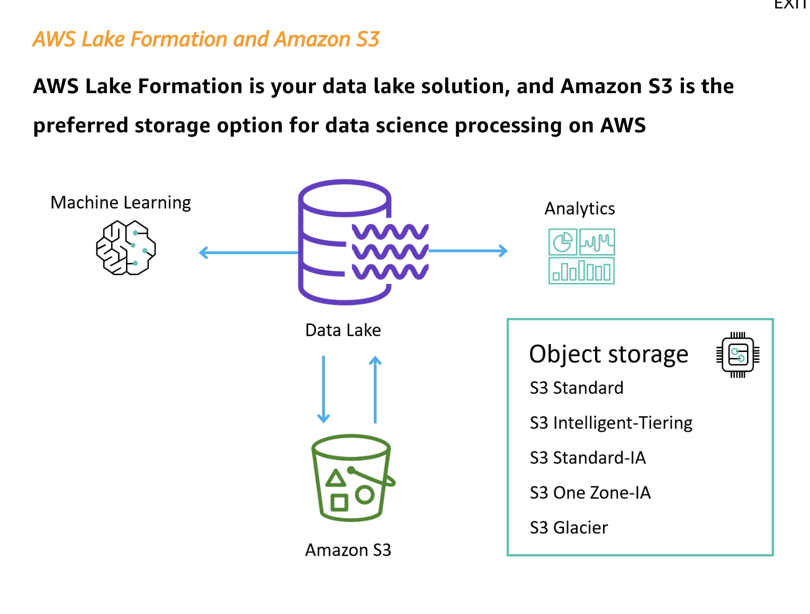
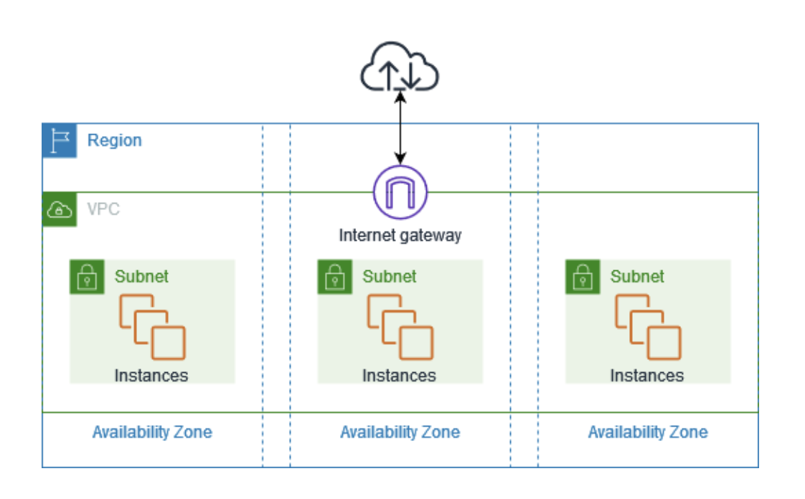

# Domain 1.1: Create data repositories for machine learning


### Terminology
* **Data Lake** - 
* **Data Mesh** - 
* **Data Warehouse** - 
* **Elastic** - varies depending on needs
* **File storage** vs **[Block Storage](https://aws.amazon.com/what-is/block-storage/)**

#### Services mentioned

* [AWS Lake Formation](https://aws.amazon.com/lake-formation/) - security & governance
* [AWS S3](https://aws.amazon.com/s3/)
* [Amazon EFS](https://aws.amazon.com/efs/)
* [Amazon EBS](https://aws.amazon.com/ebs/)
* [Amazon FSx](https://aws.amazon.com/fsx/)

# Storages for Model Training
Ranked by speed of training load time
* AWS S3
* Amazon Elastic File System. Use if you store data there, as you can start taining jobs faster without copying the content first.
* Amazon Elastic Block Storage. Faster file transfer from storage to compute than EFS
* Amazon FSx for Lustre - files system in the could. Speeds up reading repeatedly accessed data from S3


# AWS S3
AWS is an object storage that can be used as centralizsed storage for all sorts of files (structured and unstructured data), making it ideal to store ML artifacts such as model files.

**Durability**: 11 nines across multiple Availability Zones (AZ). Estimates the risk of loosing files.
**Availability**: depends on storage class, varries from 99.9% to 99.99% (uniavailable 53 min a year).

## AWS S3 Storage Classes

There are different storage classes depening on how often and quick you want to retrieve the data.
Ranked from most to least access frequency:
* Standard (frequent and instant) - 99.99% availability.
* Intelligent Tiering (changing access patterns). Moves objects between classes depending on last accesses date. 30 days => IA. 90 days => archive, ...
* Standard IA (infrequent access, instant) - cheaper than Standard, use for backups. 99.9& availability
* One Zone IA - 99.5% availability, use for data you can recreate.
* Glacier Instant Retrieval (very infrequent access, but get instanly when needed). Use for data you access once a quarter. Min storage duration 90 days.
* Glacier Flexible Retrieval (very infrequent access, but get instanly when needed). Expedited (min) | Standard (3-5h)| Bulk (5-12h) retrieval. Bulk is free. Min storage duration 90 days,
* Glacier Deep Archive (12h or 48h). Storage from 180 days. 

Availability is 99.995 for Standard, Glacier Flexible Retrieval and Glacier Deep Archive, and 99.9% for IT, Standard IA and Glacier IR.

S3 Analytics runs on top of buckets and provides recomemndations for files stored with Standard or Standard IA classes. It saves recomemndations in a csv.

## Amazon S3 Lifecycle Rules
* Transition Action - change class after x days
  * move current version between classes
  * move noncurrent versions between classes
* Expiration Actions - delete the file or older version of a file after x days
  * experied current versions
  * peremanently delete noncurrent versions
  * delete expired objects delete markers

Rules can be specified for a prefix (path) or a set of tags (key:val pairs)

## Security

##### 1 User based
IAM policy to decide which IAM user can make which API calls

##### 2 Role based
In case you want your EC2 instane to access a bucket, create an Instance Role.

##### 2 Resource Based
* Bucket policy - Bucket-wide rules that allow cross-account usage. Most common
* Object Access Control List (ACL) - fine grained
* Bucket ACL

[Bucket policy](https://docs.aws.amazon.com/AmazonS3/latest/userguide/example-bucket-policies.html) is defines as a JSON that controls which actions (list objects, get object, ...) can be performed on which resources (bucket prefix). It is specified using Allow or Deny "effects". The list of users to whom the policy applies is controled via "Principal" keyword, and '*' means all users.

```
{
"Version": "2012-10-17",
"Id": "PutObjPolicy",
"Statement": [{
  "Sid": "DenyObjectsThatAreNotSSEKMSWithSpecificKey",
  "Principal": "*",
  "Effect": "Deny",
  "Action": "s3:PutObject",
  "Resource": "arn:aws:s3:::DOC-EXAMPLE-BUCKET/*",
  "Condition": {
    "ArnNotEqualsIfExists": {
      "s3:x-amz-server-side-encryption-aws-kms-key-id": "arn:aws:kms:us-east-2:111122223333:key/01234567-89ab-cdef-0123-456789abcdef"
    }
  }
}]
}
```

##### 3 Encryption Keys

* Service-Side Encryption (SSE)
  * SSE-S3 - Encryption using S3-managed Keys (default). Encryption type AES-256. Requires adding correct header to a POST request to S3 when uploding files.
  * SSE-KMS - using KMS keys. Better management of keys via CloudTrail usage monitoring. But restricted by KMS API call quota.
  * DSSE-KMS - Dual (two layered) encryption
  * SSE-C - using customer provided keys. AWS does not store the cnryption key, so you have to pass it in the request header.
* Client-Side Encryption
Use Client-Side Encryption Library to encrypt/decrypt on client side. Requires fully managing keys & encryption cycle

HTTP headers: `"x-amz-service-side-encryption":"aws:kms"`

###### Encryption in Flight
S3 exposes two endpoints, HTTP and HTTPS. The first is not encrypted, the second uses SSL/TLS (recommended). To enforce secure connection use `aws:SecureTransport` condition in the bucket policy to deny non-secure conenctions.

## Sidenote: VPC Endpoint
Amazon [Virtual Private Cloud (Amazon VPC)](https://docs.aws.amazon.com/vpc/latest/userguide/what-is-amazon-vpc.html), allows launching AWS resources in isolated virtual networks.



### Key Features of VPC
* **Isolation and Control**: A VPC provides complete control over your virtual networking environment, including the selection of your own IP address range, creation of subnets, and configuration of route tables and network gateways.
* **Subnets** Within a VPC, you can create subnets, which are smaller, segmented portions of the VPC's IP address range. Subnets can be either public (accessible from the internet) or private (isolated from direct internet access).
* **Security Groups** Act as virtual firewalls for your instances, controlling inbound and outbound traffic at the instance level.
* **Internet Gateway** A VPC can connect to the internet via an Internet Gateway, which allows communication between your VPC and the internet.
* **NAT Gateway** If you want instances in a private subnet to access the internet (e.g., for software updates) without exposing them directly to the internet, you can use a NAT Gateway.

You can use bucket policy to control public access to your buckets. 


### Amazon EBS Volumes
??


# Domain 1.2: Identify and implement a data ingestion solution

## Services mentioned
* [AWS Kinesis](https://aws.amazon.com/kinesis/)
  * Video Streams
  * Data Streams
  * Data Firehorse
  * Data Analytics
* [AWS Glue](https://aws.amazon.com/glue/)
* [AWS Database Migration Service (DMS)](https://aws.amazon.com/dms/)
* [AWS StepFunctions](https://aws.amazon.com/stepfunctions/) - an orchestrator that can be potentially used for ETL pipelines.
* [Amazon Managed Streaming for Kafka](https://aws.amazon.com/msk/) - AWS managed Kafka

Terminology:
* **Data injestion** - Data ingestion is the process of importing larvge, assorted data files from multiple sources into a single, cloud-based storage medium—a data warehouse, data mart or database—where it can be accessed and analyzed. [Read more](https://www.teradata.com/insights/cloud-data-analytics/data-ingestion-in-analytics)

## Data Injection
There are two main types, batch and stream. **Batch processing** is used when there is no need for real-time injestion, and a periodically collected data is good enough. Batch injestion is running on a schedule (daily, monthly, ...) and is easier and cheaper to implement. on AWS it can be achieved with AWS Glue, an ETL-service. In addition, AWS DMS (database migration service that is possibel to use for this goal) or StepFunctions (a more general orchestrator alowing more complex workflows) can also be used.

With **stream processing**, on teh other hand, there is no scheduled reads of data. It is read as soon as it arrives. This is less cost-effectives, as it requires constantly monitoring changes in the data, but vital for real-time predictions. The main service for dealing with stream data in AWS is Kinesis. It provides several solutions, depending on the data type and the needs. Kinesis Video Streams processes video and audio data. [Data Streams](https://aws.amazon.com/kinesis/data-streams/) uses Producer and Client libraries to preprocess streaming data as it arrives and to emit the data. [Firehorse](https://aws.amazon.com/firehose/) allows to streams data to data lakes or warehouses. [Data Analytics](https://docs.aws.amazon.com/kinesisanalytics/latest/dev/what-is.html) provides the easiest way to process and transform the data that is streaming through Kinesis Data Streams or Kinesis Data Firehose using SQL.

## AWS Kinesis

Kinesis is an AWS streaming service, a manages alternative to Apache Kafka. Great for collecting logs, metrics, data from IoT sensors - real-time data. Uses replication across 3 AZ ro data safety.
When a test question mentions "real-time", it's probably about Kinesis.

There are 4 services within Kinesis:
* Kinesis Streams - low latency injestion at scale
* Kinesis Anlytics - real-time analytics on streams using SQL
* Kinesis Firehorse - moving data into S3 or Redshift
* Kinesis Video Streams - dealing with video streams

# Domain 1.3: Identify and implement a data transformation solution
Now we have raw injested data. However, it is not ready for ML training yet. It ussually requires cleaning (removing duplicates and/or outliers, handling missing data) for better training data quality, as well as transformations to create meaningful features out of raw data.

To assist with processing Big Data, AWS offers managed distributed framework solutions like MapReduce and Apache Spark (AWS EMR). They allow faster processing by splitting data into subsets (by datasets or other dimension) and processing the subsets in parallel on different nodes, before aggregating (reducing) individual results. 

For tabular data AWS Redshift Spectrum or Athena can be used. They allow querying files stored on S3 buckets using SQL. For other types AWS Glue can be used

## Services mentioned
* [AWS Glue](https://aws.amazon.com/glue/)
* [AWS Athena](https://aws.amazon.com/athena/)
* [AWS Redshift Spectrum](https://docs.aws.amazon.com/redshift/latest/dg/c-getting-started-using-spectrum.html) - quary data stored on S3 using SQL and Redshift cluster
* [Amazon Managed Streaming for Kafka](https://aws.amazon.com/msk/) - AWS managed Kafka

Terminology:
* **Data injestion** - Data ingestion is the process of importing larvge, assorted data files from multiple sources into a single, cloud-based storage medium—a data warehouse, data mart or database—where it can be accessed and analyzed. [Read more](https://www.teradata.com/insights/cloud-data-analytics/data-ingestion-in-analytics)

## Question example
> A data engineer needs to create a cost-effective data pipeline solution that ingests unstructured data from various sources and stores it for downstream analytics applications and ML. The solution should include a data store where the processed data is highly available for at least one year, so that data analysts and data scientists can run analytics and ML workloads on the most recent data. For compliance reasons, the solution should include both processed and raw data. The raw data does not need to be accessed regularly, but when needed, should be accessible within 24 hours. 
>
> What solution should the data engineer deploy?

* Use Amazon S3 Standard for all raw data. Use Amazon S3 Glacier Deep Archive for all processed data.

* Use Amazon S3 Standard for the processed data that is within one year of processing. After one year, use Amazon S3 Glacier for the processed data. Use Amazon S3 Glacier Deep Archive for all raw data.

* Use Amazon Elastic File System (Amazon EFS) for processed data that is within one year of processing. After one year, use Amazon S3 Standard for the processed data. Use Amazon S3 Glacier Deep Archive for all raw data.

* Use Amazon S3 Standard for both the raw and processed data. After one year, use Amazon S3 Glacier Deep Archive for the raw data.


