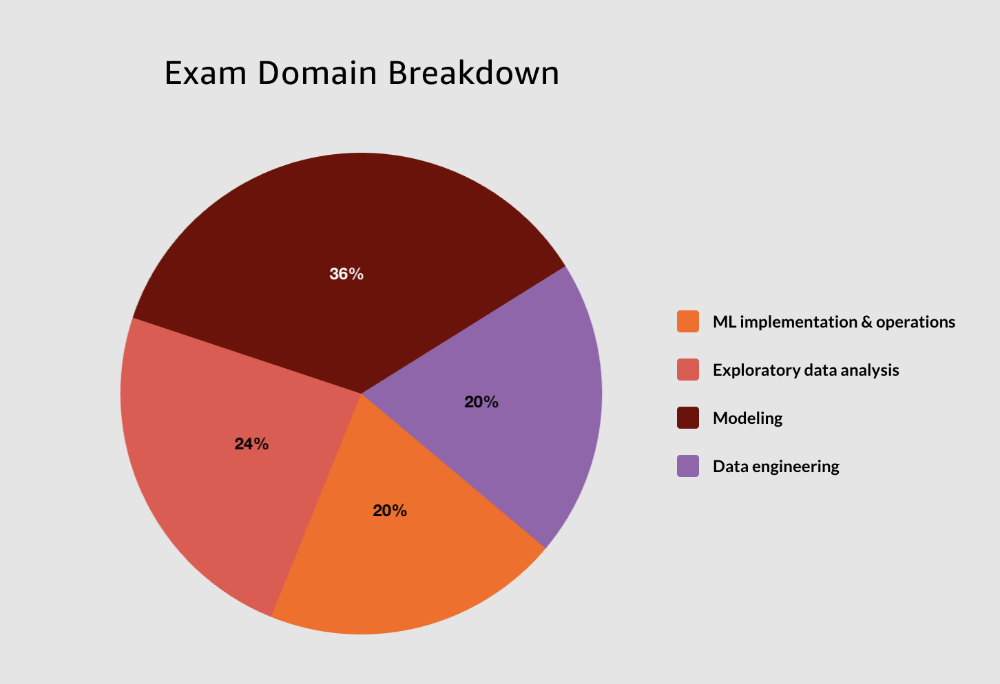

# Exam Readiness: AWS Certified Machine Learning - Specialty

## Intended audience and prerequisites

To make the most of this course, you should be a machine learning (ML) practitioner with at least one year of experience working with ML. You should have:

    • Proficiency expressing the intuition behind basic ML algorithms and performing basic hyperparameter optimization
    • Understanding of the ML pipeline and its components
    • Experience with ML and deep learning frameworks
    • Understanding of and experience in model training, deployment, and operational best practices

## Learning objectives

By the end of this course, you will be able to:

    • Identify your strengths and weaknesses in each exam domain so that you know what to focus on when studying for the exam
    • Describe the technical topics and concepts that make up each of the exam domains
    • Summarize the logistics and mechanics of the exam and its questions
    • Use effective strategies for studying and taking the exam

The AWS Certified Machine Learning – Specialty exam is designed to validate your ability to build, train, tune, and deploy ML models using the AWS Cloud. This includes your ability to:

 

Choose the right approach for your business problem
Use the right AWS services to implement ML solutions
Design and implement scalable, cost-optimized, reliable, and secure ML solutions
The exam’s technical content covers four separate domains. These domains include three to five subdomains. The domains include Data Engineering, Exploratory Data Analysis, Modeling, and ML Implementation and Operations.

## Domain Breakdown

